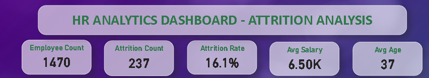
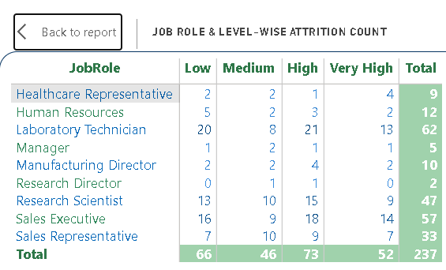
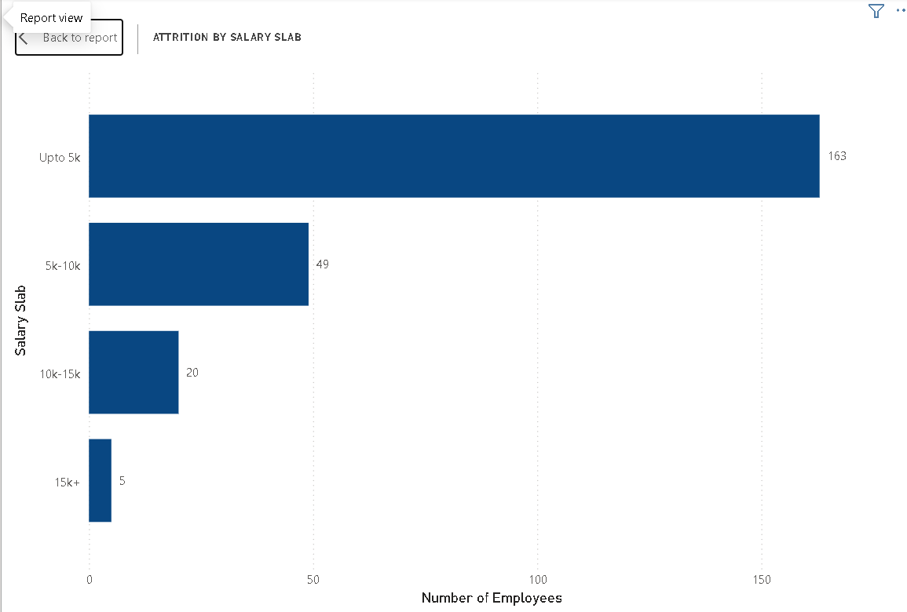
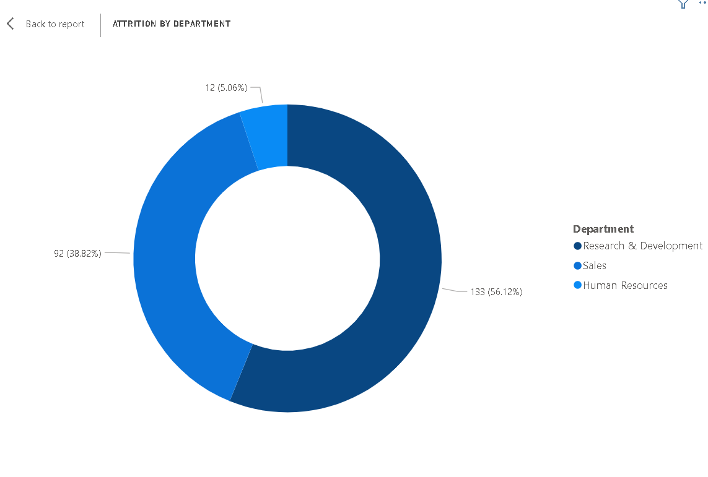
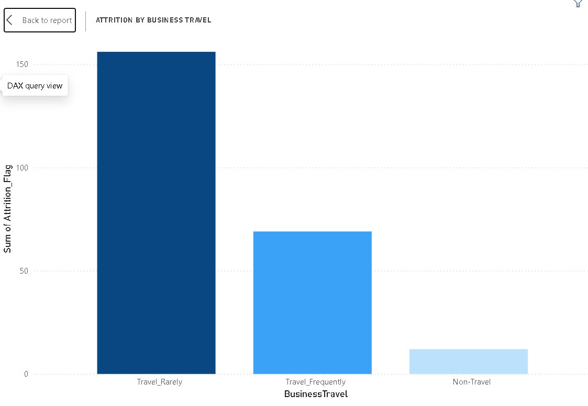
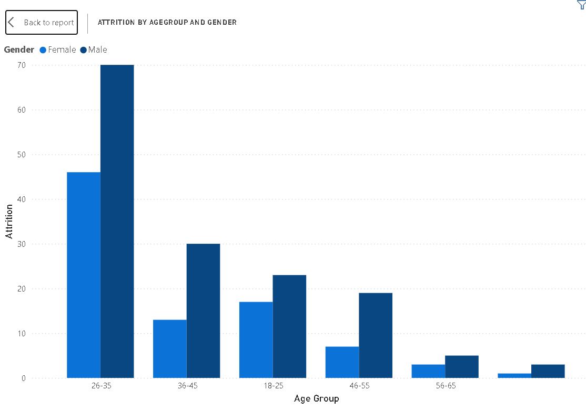

# 👥 HR Attrition Analytics

**Data-driven employee retention strategy | Python · SQL · Power BI**

---

## Executive Overview

This project develops an integrated analytics framework to evaluate employee attrition patterns, identify key drivers of turnover, and provide data-driven retention strategies within an organization.

The objective is to shift from reactive exit management toward **proactive retention planning**.

We track basic exit data, but we do not consistently measure:

- **Which departments and roles** have the highest turnover
- **What drives employees to leave** (salary, overtime, promotion delays, satisfaction issues)
- **The true cost** of employee turnover
- **Early warning signs** before attrition becomes critical
- **The ROI of retention efforts**

Using **Python, SQL, and Power BI**, this project analyzes 1,470 employees to identify actionable retention strategies and quantify potential savings.

---

## Problem Statement

### Current State

Today, we deploy significant resources across our workforce — recruitment, training, and development — yet we have **no integrated mechanism — effectively 0% structured monitoring** — to systematically measure whether we are retaining talent effectively and addressing the root causes of attrition.

We currently track basic exit data, but we do not consistently measure:

- **Which departments and roles** are driving attrition
- **Why employees leave** (salary gaps, overtime burden, promotion delays, satisfaction issues)
- **The true cost** of employee turnover
- **Early warning signs** before attrition becomes critical
- **The ROI of retention efforts**

If even **5–10% of our workforce leaves unexpectedly**, the impact directly translates into:

- **Diluted team performance** — loss of institutional knowledge and productivity
- **Increased recruitment costs** — 50-100% of annual salary per replacement
- **Pressure on cost-to-income ratio** — training costs for new hires
- **Weakened organizational stability** — burnout risk for remaining employees
- **Loss of client relationships** — disruption in service delivery

Additionally, if projected retention targets are missed by even **10–20%**, the assumed operational stability embedded in our workforce planning becomes unreliable.

In short, we are managing **exit documentation** — not **retention strategy**, thus the need from **0% structured monitoring** to **a 100%, fully-structured retention governance mechanism**.

---

### Current State vs Ideal State

| Dimension | Current State | Ideal State | Gap |
|-----------|--------------|-------------|-----|
| **Attrition Rate** | 16.1% (237 employees) | **10%** (147 employees) | 6.1% reduction needed |
| **Annual Turnover Cost** | $9.2M | **$5.7M** | $3.5M cost gap |
| **High-Risk Employees** | 839 (57% of workforce) | **30%** (441 employees) | 398 employees at risk |
| **Overdue for Promotion** | 373 (25% of workforce) | **10%** (147 employees) | 226 employees overdue |
| **Sales Representative Attrition** | 39.8% (33 employees) | **15%** (12 employees) | 21 employees leaving |
| **Low Salary Attrition (<5k)** | 70% of leavers (163 employees) | **40%** of leavers | 30% improvement needed |
| **Overtime Leaver Rate** | 30.8% (128 employees) | **15%** (62 employees) | 66 employees leaving |

---

### The Cost of Inaction

If we do nothing:

- **Next year:** Another **237 employees** will leave, costing **$9.2M**
- **3-year impact:** **711 employees** lost → **$27.6M** in turnover costs
- **Talent drain:** Critical roles like Sales Representatives and Laboratory Technicians will continue to suffer 20-40% attrition rates
- **Competitive disadvantage:** High-risk employees (57% of workforce) may become disengaged before leaving

---

### The Opportunity

If we implement targeted retention strategies based on data-driven insights:

- **10% attrition reduction** = **$924K annual savings**
- **20% attrition reduction** = **$1.8M annual savings**
- **Achieving 10% target rate** = **$3.5M annual savings**

This translates to:
- **398 high-risk employees** stabilized
- **226 employees** receive overdue promotions
- **95 high-risk role employees** (Sales Reps, Lab Techs) retained
- **163 low-salary employees** see compensation adjustments

---

### What We Need to Solve

**The Core Question:**

> *How can we reduce employee attrition from 16.1% to 10%, saving $3.5M annually, by identifying and addressing the key drivers of turnover across departments, roles, and employee segments?*

**Key Sub-Questions:**

1. **Where** is attrition happening? (Which departments, roles, age groups?)
2. **Why** are employees leaving? (Salary, overtime, promotion delays, satisfaction?)
3. **Who** is most at risk? (Demographic patterns, high-risk flags)
4. **When** do employees leave? (Tenure patterns, early vs late turnover)
5. **What** interventions will yield the highest ROI?

---

## Data

This project uses the **IBM HR Analytics Employee Attrition & Performance** dataset from Kaggle.

- **Dataset Link:** [IBM HR Analytics Employee Attrition & Performance](https://www.kaggle.com/datasets/pavansubhasht/ibm-hr-analytics-attrition-dataset)

### Dataset Characteristics:

| Feature | Description |
|---------|-------------|
| **Total Records** | 1,470 employees |
| **Total Features** | 35 attributes |
| **Target Variable** | `Attrition` (Yes/No) |
| **Time Period** | Cross-sectional data (current snapshot) |

### Key Variables Included:

| Category | Variables |
|----------|-----------|
| **Demographics** | Age, Gender, Marital Status, Education Field |
| **Job Information** | Department, Job Role, Job Level, Job Involvement |
| **Compensation** | Monthly Income, Hourly Rate, Stock Option Level, Percent Salary Hike |
| **Tenure** | Years at Company, Years in Current Role, Years Since Last Promotion |
| **Work-Life** | Overtime, Business Travel, Distance From Home |
| **Satisfaction** | Job Satisfaction, Work-Life Balance, Environment Satisfaction |
| **Performance** | Performance Rating, Relationship Satisfaction |

This dataset was used to simulate:

- Attrition patterns across departments and roles
- Key drivers of employee turnover
- Cost impact analysis
- Risk identification for proactive intervention

---

## Methodology

### 1️⃣ Data Engineering — Python (Jupyter Notebook)

1. **Data Cleaning** – Removed duplicates, handled missing values, standardized text formats (e.g., "Yes"/"No" to 1/0 flags), and validated data integrity to ensure analytical accuracy.

2. **Feature Engineering** – Created new columns to enable deeper analysis:
   - `Age_Group`: 5-year age brackets (18-25, 26-35, 36-45, 46-55, 56-65)
   - `Tenure_Group`: Tenure categories (0-2, 2-5, 5-10, 10-20, 20+ years)
   - `Salary_Group`: Quartile-based salary bands
   - `High_Risk`: Flag for employees with low/medium satisfaction
   - `Long_Without_Promo`: Flag for employees overdue >3 years for promotion

3. **Text-to-Numeric Mapping** – Converted categorical satisfaction levels to numeric scores:
   - Low → 1, Medium → 2, High → 3, Very High → 4
   - Enabled statistical analysis and averaging

4. **Cost Modeling** – Calculated turnover cost using:
   - Average monthly income × 12 = annual salary
   - Cost per hire = 50% of annual salary (industry standard)
   - Total turnover cost = attrition count × cost per hire

5. **Export Cleaned Dataset** – Saved final dataset as CSV for Power BI import and PostgreSQL loading.

### 2️⃣ Database Management — PostgreSQL

1. **Database Creation** – Set up PostgreSQL database `hr_attrition` to store and validate the cleaned data.

2. **Table Schema Design** – Created optimized table structure with 25 columns matching the Power BI dataset.

3. **Data Import** – Loaded cleaned CSV into PostgreSQL using COPY command.

4. **SQL Validation** – Wrote 10 business queries to validate Python findings:
   - Department attrition analysis
   - Job role analysis
   - Salary impact queries
   - Overtime and tenure patterns
   - Age group and gender breakdowns

5. **Data Integrity Checks** – Verified row counts (1,470) and attrition totals (237) matched Python calculations.

### 3️⃣ Data Visualization — Power BI

1. **Executive Dashboard Design** – Built a decision-focused reporting interface aligned to HR KPIs and retention objectives.

2. **KPI Overview** – Created 6 cards displaying key metrics:
   - Total Employees (1,470)
   - Total Attrition (237)
   - Attrition Rate (16.1%)
   - Average Age (37)
   - Average Salary (6.5K)
   - Average Tenure (7.0 years)

3. **Attrition by Department** – Designed donut charts showing distribution across Sales, R&D, and HR.

4. **Job Role vs Satisfaction Matrix** – Built a detailed heatmap table showing attrition counts by job role and satisfaction level, with conditional formatting for high-risk cells.

5. **Driver Analysis** – Created bar charts for:
   - Attrition by Age Group & Gender (stacked)
   - Attrition by Salary Slab (4 bands)
   - Attrition by Business Travel
   - Attrition by Years at Company

6. **Interactive Filters** – Added slicers for Department, Job Role, Age Group, and Gender to enable dynamic exploration.

7. **Cost Impact Calculation** – Implemented DAX measures to calculate total turnover cost and potential savings from attrition reduction.

---

## 📸 Visual Walkthrough

### 1. The Cost of Turnover – KPI Overview

The organization loses **237 employees annually** at a **16.1% attrition rate**, costing an estimated **$9.2M per year**. With **839 employees flagged as high-risk** and **373 overdue for promotion**, the potential for further loss is significant.

---

### 2. Job Role vs Satisfaction Matrix – Where the Problem Concentrates

Laboratory Technicians (62), Sales Executives (57), and Research Scientists (47) account for the highest number of leavers. Notably, **73 employees left despite "High" satisfaction** — suggesting external opportunities, not dissatisfaction, drive their departure.

---

### 3. Salary Impact – The Compensation Gap

**70% of leavers earn under ₱5,000/month**, accounting for **163 of 237 leavers**. This wage gap is a primary retention risk, particularly for entry-level roles in Sales and R&D.

---

### 4. Department & Travel – Where to Intervene

The **Sales department drives 57% of total attrition**, followed by R&D. Frequent business travel also correlates with higher risk, suggesting work-life balance factors need review.

---

### 5. Age & Gender – Demographic Patterns

The **26–35 age group accounts for the most leavers**, with males slightly outnumbering females. Targeted retention programs for early-career employees could yield the highest impact.

---

## Insights

### 1️⃣ Sales Department Crisis

Sales Representatives have the highest attrition rate at **39.8%**, with Sales Executives also showing elevated turnover. The Sales department accounts for **57% of total attrition**.

### 2️⃣ Compensation Gap

Employees earning **less than ₱5,000/month** represent **70% of all leavers** (163 employees). The average leaver earns **₱3,290 less** than the average stayer.

### 3️⃣ Overtime Impact

Employees who work overtime leave at **3x the rate** (30.8% vs 10.3%). Overtime is most prevalent in Sales (29%) and Research Scientist roles (36%).

### 4️⃣ Early Tenure Risk

**26.7% of attrition occurs in the first two years**, with a secondary peak at 10+ years. This indicates both early-fit issues and long-term burnout patterns.

### 5️⃣ Satisfaction Paradox

**73 employees left despite reporting "High" satisfaction**, suggesting external opportunities (higher pay, better roles) drive departure more than dissatisfaction.

### 6️⃣ Age Concentration

The **26–35 age group** accounts for the most leavers, representing early-career professionals who may be seeking advancement or salary growth.

---

## Recommendations

| Priority | Action | Target | Expected Impact |
|----------|--------|-------|-----------------|
| **1** | Review compensation for roles earning <₱5,000/month | 163 employees | Reduce entry-level attrition by 30% |
| **2** | Implement retention program for Sales Reps & Lab Techs | 95 employees | Stabilize highest-risk roles |
| **3** | Create promotion track for 373 overdue employees | 25% of workforce | Improve satisfaction and retention |
| **4** | Investigate overtime policies in Sales department | 57% of attrition | Improve work-life balance |
| **5** | Exit interview "High satisfaction" leavers | 73 employees | Understand external opportunities |

### Governance Framework

1. **Embed Retention Metrics in HR Reviews** – Use attrition rate, high-risk %, and turnover cost as quarterly KPIs.  
   *Coverage to be achieved: 30%*

2. **Reallocate Budget Using Risk Score** – Shift retention budget toward highest-risk roles identified in analysis.  
   *Coverage to be achieved: 20%*

3. **Institutionalize Exit Insights** – Mandate structured exit interviews for all "High satisfaction" leavers.  
   *Coverage to be achieved: 30%*

4. **Implement Early Warning Dashboards** – Deploy attrition heatmaps to HR leadership monthly.  
   *Coverage to be achieved: 20%*

---

## What This Proposal Changes

This framework introduces, for the first time:

- **Quantified cost of turnover** ($9.2M annual)
- **Role-specific risk profiles** (39.8% for Sales Representatives)
- **Driver-based retention strategy** (salary, overtime, promotion delays)
- **High-risk employee tracking** (839 employees identified)
- **Savings projection modeling** ($924K from 10% reduction)

We move from **0% structured retention monitoring** to a governance mechanism capable of tracking attrition drivers at **100% employee coverage**.

This shifts workforce management from **reactive exit processing** to **proactive retention optimization**.

---

## Business Impact

If implemented:

- **$924K annual savings** from 10% attrition reduction
- **Improved employee engagement** through targeted interventions
- **Data-driven HR strategy** replacing guesswork
- **Reduced recruitment costs** and productivity loss
- **Stronger talent retention** across critical roles

---

## Tools & Technologies

| Phase | Tool | Purpose |
|-------|------|---------|
| **Data Cleaning** | Python (Pandas, NumPy) | Data transformation, feature engineering, cost modeling |
| **Development Environment** | Jupyter Notebook | Interactive code development and documentation |
| **Database** | PostgreSQL | Data storage, validation, and SQL query execution |
| **Analysis** | SQL | Business queries for validation and insights |
| **Visualization** | Power BI | Interactive dashboard, DAX measures, executive reporting |
| **Version Control** | Git & GitHub | Portfolio documentation and sharing |

---

## Repository Structure

---

## Author

**Data Analytics Portfolio Project**

**Tools:** Python (Pandas, NumPy) · PostgreSQL · SQL · Power BI

📅 March 2026

---

## License

This project is for educational and portfolio purposes. Dataset is from Kaggle's IBM HR Analytics Employee Attrition dataset, used under Kaggle's open data license.
